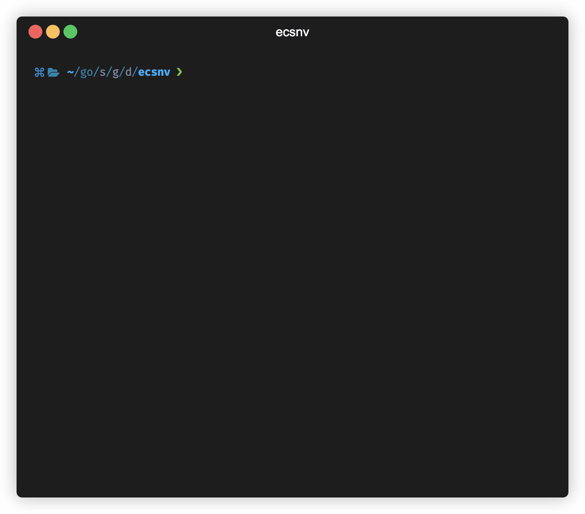
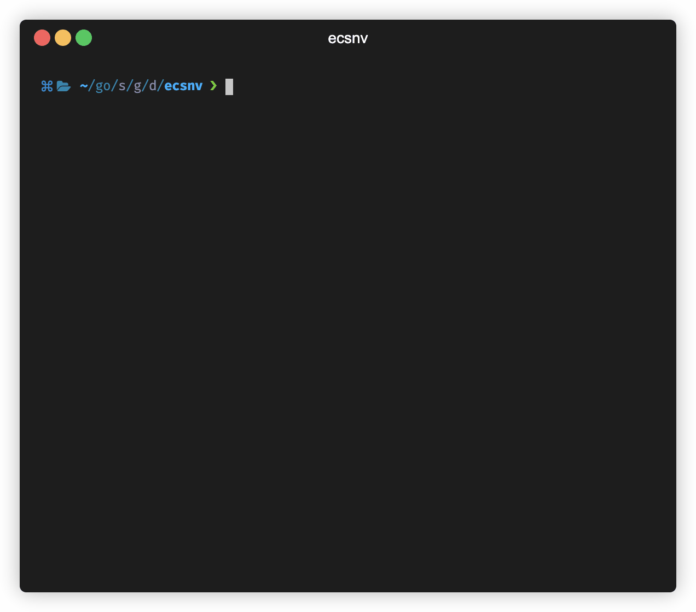

# ecsnv

[](https://github.com/gomods/athens)

A lightweight utility to dump AWS Farget's ECS containers environment variables locally

## Motivation

More often than not, during the development cycle. I keep looking at my AWS ECS cluster and services to check what all environment
variables have been set. Some ENVs were not readily available in the project repository since they were configured as secrets in SSM's parameter store.

While setting up an application or debugging some issue, I kept looking for env values for a set in different environments by logging in to the AWS console, which is painstakingly slow and hampers productivity.

Hence the tool.

## Installation

### Homebrew

```shell
brew tap dineshgowda24/dineshgowda
brew install ecsnv
```

### Go

```shell
go install github.com/dineshgowda24/ecsnv@latest
```

## Usage

1. Fetching ENVs for a specific cluster and service

    1. Prints locally in the shell

    ```shell
    ecsnv --cluster <cluster_name> --service <service_name>
    ```

    2. Writes to a file

    ```shell
    ecsnv --cluster <cluster_name> --service <service_name> --file <file_name>
    ```

2. Fetching ENVs for a specific cluster and service from a particular profile

    If a profile is not passed, then the default profile is used.

     1. Prints locally in the shell

    ```shell
    ecsnv --cluster <cluster_name> --service <service_name> --profile <aws_profile_name>
    ```

    2. Writes to a file

    ```shell
    ecsnv --cluster <cluster_name> --service <service_name> --file <file_name> --profile <aws_profile_name>
    ```

3. You can ignore the cluster or service name. The application will list all the clusters and services in the profile with an easy-to-use interactive shell.

    1. Prints locally in the shell

    ```shell
    ecsnv
    ```

    2. Writes to a file

    ```shell
    ecsnv  --file <file_name>
    ```

## Demo

### Printing ENVs in terminal



### Writing ENVs to file


